## File and Directory Permissions Project
### Step 1: Access the Linux System
- For this project, make use of a Vagrant Linux box and access it using vagrant ssh. 
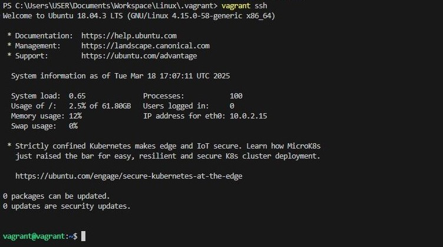

### Step 2: Open a Terminal
- If you're not already in a terminal session, open a terminal window. You'll use this terminal to execute commands.
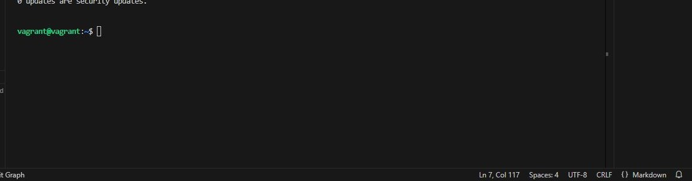

### Step 3: Create and Navigate to the Directory
- Create a new directory named <code>pistis</code> and navigate into it:

> mkdir pistis
    
    cd pistis

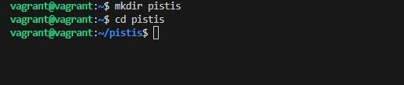

### Step 4: Create Files and Directories
- Create a sample file and directory to work with:

>   touch example.txt

    mkdir exampledir

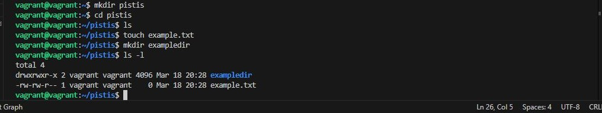

### Step 5: List Files and Directories
- List the files and directories in the current location to identify the ones you want to modify permissions for:

> ls -l

### Step 6: Modify File Permissions (chmod)
- To modify file permissions, use the chmod command followed by the desired permissions and the filename. For example, to give read and write permissions to a file named "example.txt" for the owner:

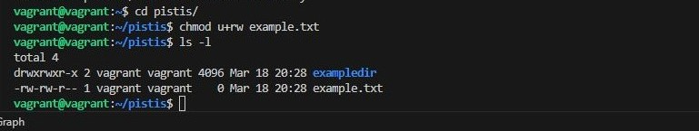

### Step 7: Modify Directory Permissions (chmod)
- To modify directory permissions, use the chmod command similarly to modifying file permissions. For example, to give read, write, and execute permissions to a directory named "exampledir" for the owner:

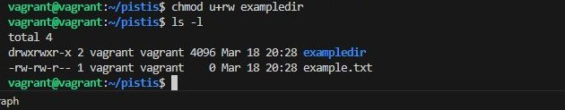

### Step 8: Create a New Group
- Create a new group named pistisgroup:

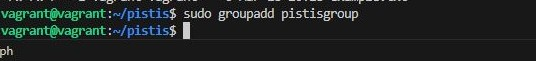

### Step 9: Create a New User
- Create a new user named pistisuser and add them to the pistisgroup group:

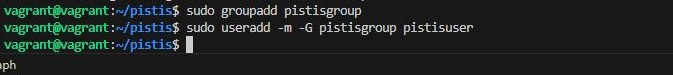

### Step 10: Change File Owner (chown)
- To change the owner of a file, use the chown command followed by the new owner's username and the filename. For example, to change the owner of a file "example.txt" to the user pistisuser:

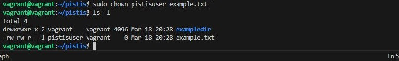

### Step 11: Change Directory Owner (chown)
- To change the owner of a directory, use the chown command similarly to changing file ownership. For example, to change the owner of a directory "exampledir" to the user pistisuser:

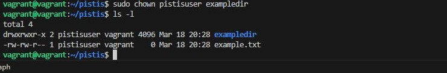

### Step 12: Change Group Ownership (chgrp)
- To change the group ownership of a file or directory, use the chgrp command followed by the group name and the filename or directory name. For example, to change the group ownership of "example.txt" to pistisgroup:

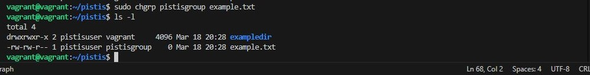

### Step 13: Verify Permissions and Ownership
- Check the permissions and ownership of files and directories to ensure they have been modified as desired:

[screenshot-13](chgrp.JPG)

### Step 14: Test Access
- Log in as the new owner (if applicable) and test access to the modified files and directories to ensure the changes are effective:

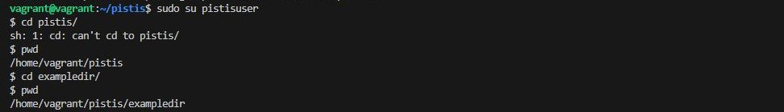

### Step 15: Setuid, Setgid, and Sticky Bit
- Setuid (Set User ID): Ensures that a file is executed with the permissions of the file's owner

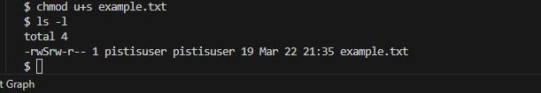

- Setgid (Set Group ID)
> chmod g+s exampledir

    ls -ld exampledir

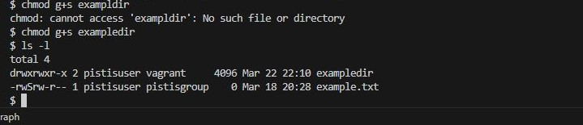

- Sticky Bit: Ensures that files created in a directory inherit the group of the directory
> chmod +t exampledir

    ls -ld exampledir

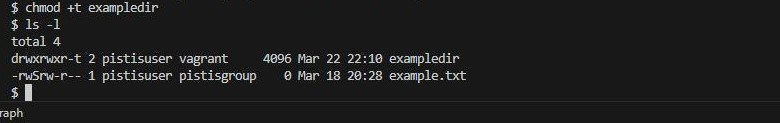

### Step 16: Recursive Permissions
- Recursive chmod: is useful in real-world scenarios where multiple files and subdirectories need permission changes at once.

> chmod -R 755 exampledir

    ls -lR exampledir

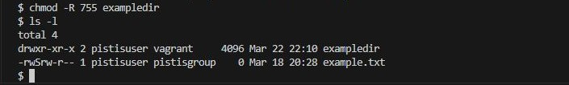

### Step 17: Default Permissions (umask)
- Check Default umask : umask is used to restrict permissions, and you can modify it to set different default permissions.

> umask

