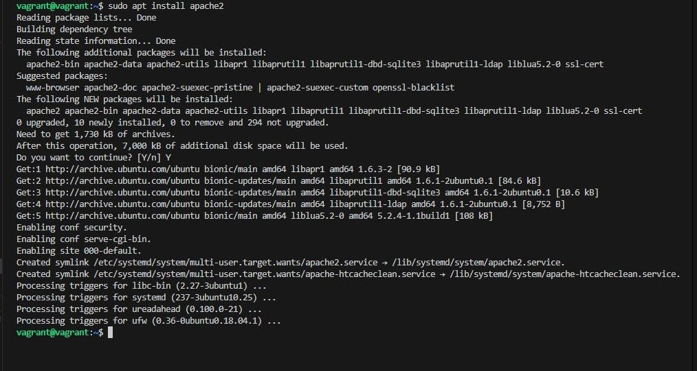
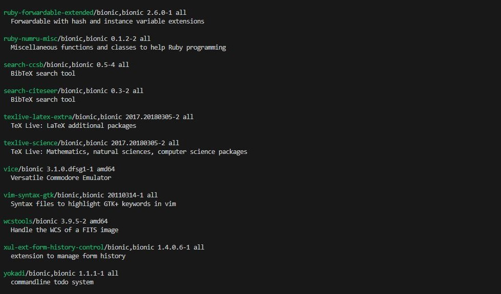
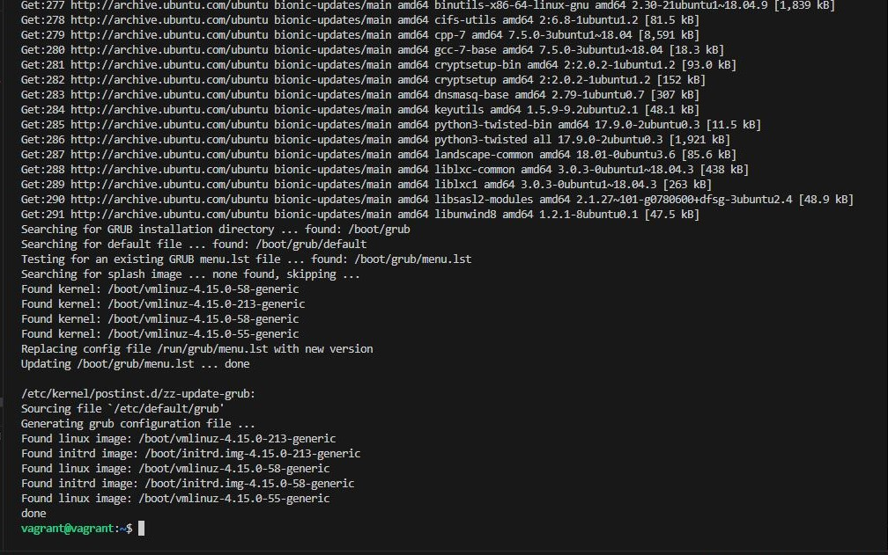

## Package Management Project

### Step 1: Access the Linux System
- For this project, make use of a Vagrant Linux box and access it using vagrant ssh.

Expected Output (after accessing Vagrant):

Welcome to Ubuntu 20.04.3 LTS (GNU/Linux 5.4.0-104-generic x86_64)
...
vagrant@ubuntu-focal:~$

### Step 2: Open a Terminal
- If you're not already in a terminal session, open a terminal window. You'll use this terminal to execute package management commands.

### Step 3: Update Package Repositories
- Before installing or updating packages, it's essential to update the package repositories to get the latest package information. Use the appropriate command based on your Linux distribution:
    - For Debian/Ubuntu (apt):

        > sudo apt update

    

### Step 4: Install a Package
- To install a new package, use the appropriate command for your package manager. Replace package-name with the name of the package you want to install.
    - For Debian/Ubuntu (apt):

    > sudo apt install apache2

    

### Step 5: Remove a Package
- To remove an installed package, use the appropriate command for your package manager. Replace package-name with the name of the package you want to remove.
    - For Debian/Ubuntu (apt):

    > sudo apt remove apache2

    

### Step 6: Search for Packages
- To search for available packages, you can use the search functionality of your package manager.
    - For Debian/Ubuntu (apt):

    > apt search keyword

    

### Step 7: List Installed Packages
- You can list all installed packages on your system using the following command:
    - For Debian/Ubuntu (apt):

    > dpkg --list

    

### Step 8: Upgrade Installed Packages
- To upgrade installed packages to their latest versions, use the appropriate command for your package manager:
    - For Debian/Ubuntu (apt):

    > sudo apt upgrade

    

### 