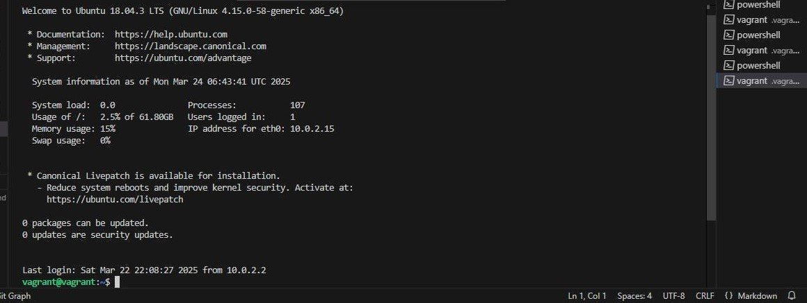
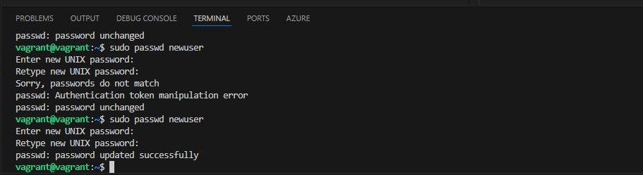
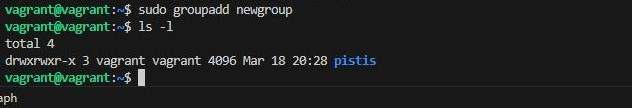
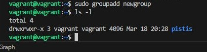
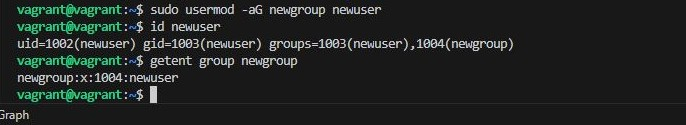
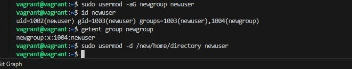

## User and Group Management Project
### Step 1: Access the Linux System
- For this project, make use of a Vagrant Linux box and access it using <code>vagrant ssh</code>

### Step 2: Open a Terminal
- If you're not already in a terminal session, open a terminal window. You'll use this terminal to execute user and group management commands.

### Step 3: Create a New User
- Create a new user using the useradd command. Replace newuser with the desired username.

    > sudo useradd newuser

### Step 4: Set a Password for the New User
- Set a password for the new user using the passwd command:

    > sudo passwd newuser

### Step 5: Create a New Group
- Create a new group using the groupadd command. Replace newgroup with the desired group name.

    > sudo groupadd newgroup

### Step 6: Add User to a Group
- Add the newly created user to the group using the usermod command. Replace newuser with the username and newgroup with the group name.

    > sudo usermod -aG newgroup newuser

### Step 7: Verify User and Group Creation
- Check if the new user and group have been created successfully:

    >   id newuser
        
        getent group newgroup

    

### Step 8: Modify User and Group Information
- You can modify user and group information using the usermod and groupmod commands. For example, to change the user's home directory:

    >   sudo usermod -d /new/home/directory newuser

### Step 9: Delete a User
- To delete a user, use the userdel command. Be careful, as this will remove the user account.

    >   sudo userdel -r newuser

### Step 10: Delete a Group
- To delete a group, use the groupdel command. Be cautious, as this will remove the group.

    >   sudo groupdel newgroup

