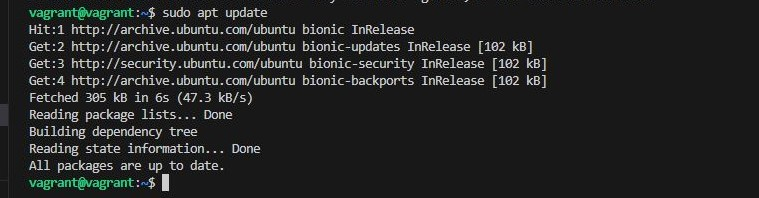
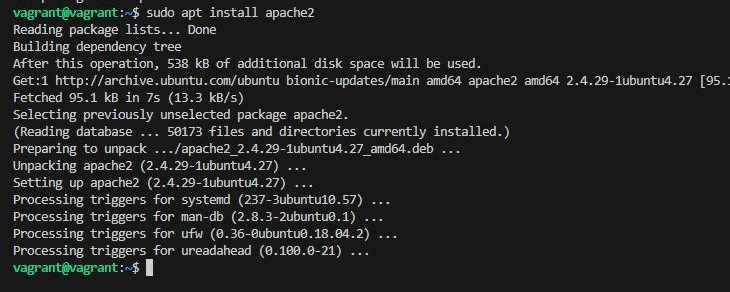
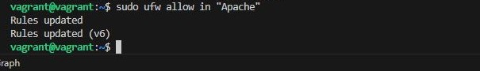
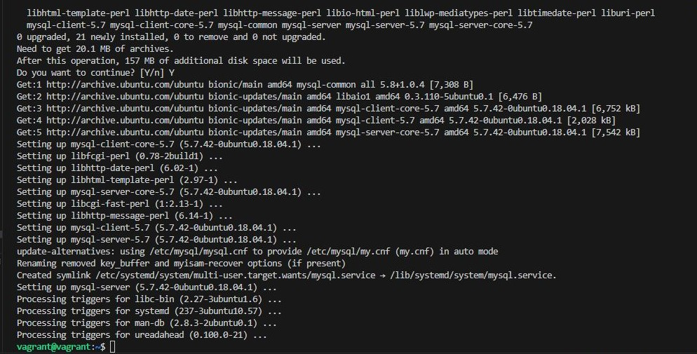
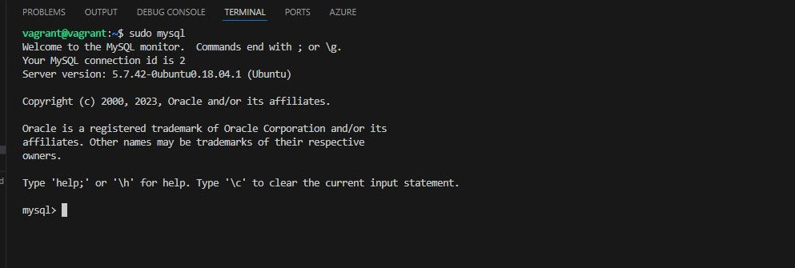
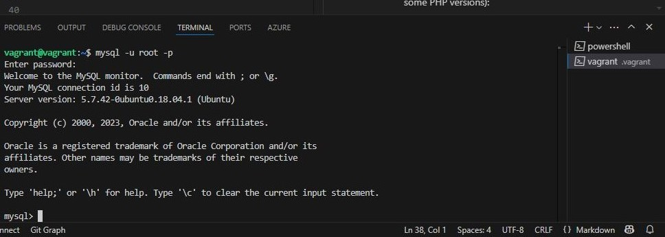
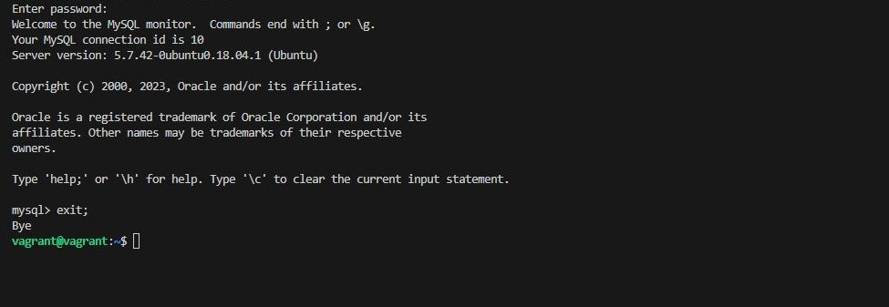
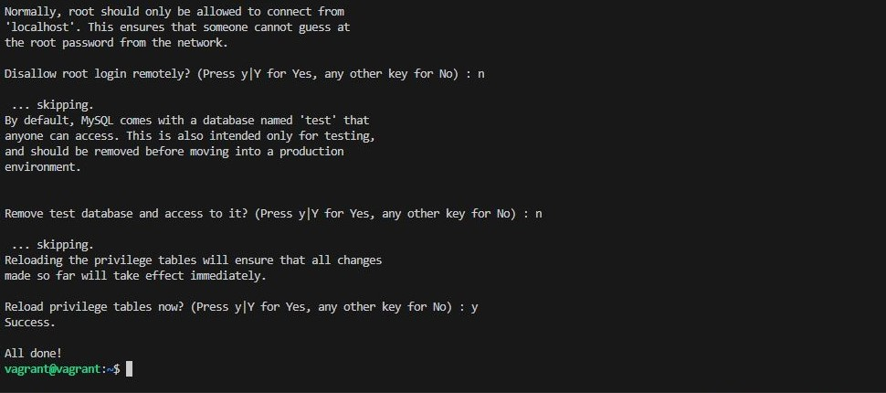

## LAMP STACK (Lab Guide)
### Step 1 — Installing Apache and Updating the Firewall
- Update the package manager cache:
   
    >   sudo apt update

- Install Apache:

    >   sudo apt install apache2

    

- Allow HTTP traffic through the firewall:
    
    >   sudo ufw allow in "Apache"

### Step 2 — Installing MySQL
-   Install MySQL:

    >   sudo apt install mysql-server

- Connect to MySQL as the root user:

    >   sudo mysql

- Change root user's authentication method to mysql_native_password (for compatibility with some PHP versions):

    >   ALTER USER 'root'@'localhost' IDENTIFIED WITH mysql_native_password BY 'password';

- Exit the MySQL console:

    >   exit

    

- Run the MySQL security script:

    >   sudo mysql_secure_installation

